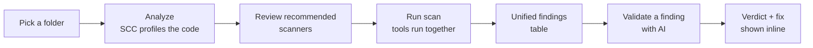

# Secure Code Review Dashboard

**Run four security scanners on your code at once, see every finding in one place, and let an AI tell you which ones are real.**


---

## Table of contents

1. [What is this?](#what-is-this)
2. [How it works](#how-it-works)
3. [Quick start](#quick-start) — [Docker](#option-a--docker-easiest) · [Installer](#option-b--one-shot-installer-bare-metal)
4. [Using the dashboard](#using-the-dashboard)
5. [Setting up AI validation](#setting-up-ai-validation)
6. [Setting up scanner tokens](#setting-up-scanner-tokens)
7. [The scanners explained](#the-scanners-explained)
8. [Configuration reference](#configuration-reference)
9. [Troubleshooting](#troubleshooting)
10. [API reference](#api-reference)
11. [For developers](#for-developers)
12. [Security & privacy](#security--privacy)

---

## What is this?

Security tools each find different things, run differently, and report differently. Running Semgrep, SonarQube, Snyk, and SCC by hand — then reading four separate outputs and figuring out which alerts actually matter — is slow and tedious.

This is a **local web dashboard** that does all of that for you:

- **One place to run them** — point it at a folder, it runs the scanners together and merges the results into a single, sortable findings table.
- **Security-focused** — the scanners are configured to report **vulnerabilities and secrets only**, not code-style or "maintainability" noise.
- **AI triage** — for any finding, click **Validate** and an AI reads the actual surrounding code and tells you whether it's a real vulnerability (`confirmed`), partly real (`partially_true`), or a `false_positive` — with a justification, impact, and a fix.

It runs entirely on your machine, binds to `localhost`, and stores everything (scans, findings, API keys) in a local SQLite file. Nothing is sent anywhere except the AI provider *you* choose, and only when *you* click Validate.

> **Who it's for:** developers and security engineers doing a code review on a project they have on disk.

---

## How it works

The workflow is three steps: **Analyze → Run → Validate.**



1. **Analyze** — you give it a project path. It runs **SCC** first (fast) to profile the codebase — languages, size, dependency files — then recommends *which* scanners make sense for that project, with a reason for each.
2. **Run** — you confirm or adjust the tool selection and hit **Run scan**. The chosen scanners run in parallel; results stream into one view with severity badges, per-tool tabs, and code metrics.
3. **Validate** — optionally, click **Validate** on any finding to have an AI judge whether it's real, using the code around it.

---

## Quick start

You have two ways to install. **Docker is the easiest** (nothing to install but Docker). The **installer** sets you up without Docker for everything except the SonarQube server.

### Option A — Docker (easiest)

Everything (the app **and** all four scanners) is baked into one image. You only need [Docker Desktop](https://www.docker.com/products/docker-desktop/).

```bash
# 1. Point it at the folder that contains the repos you want to scan.
#    They show up inside the app under /projects/<repo-name>.
echo "SCAN_ROOT=C:/Users/you/code" > .env

# 2. Build and start the dashboard + SonarQube server together.
docker compose up -d --build
```

Open **http://localhost:8000**. To scan a repo, type its path as `/projects/<repo-name>` and click **Analyze**.

> SonarQube takes ~1–2 minutes to boot the first time. You don't need to configure a SonarQube token — the app creates one automatically (see [scanner tokens](#setting-up-scanner-tokens)).

### Option B — one-shot installer (bare-metal)

Prefer to run it directly with Python? The installer creates a virtual environment and downloads all four scanner CLIs **into the project folder** (nothing touches your global system).

**Windows** — double-click **`install.bat`**, or run it from any terminal:

```text
install.bat
```

**Linux / macOS:**

```bash
./install.sh
```

Then start the app:

```bash
# Windows
.venv\Scripts\Activate.ps1
uvicorn app.main:app --host 127.0.0.1 --port 8000

# Linux / macOS
source .venv/bin/activate
uvicorn app.main:app --host 127.0.0.1 --port 8000
```

Open **http://localhost:8000**.

> **SonarQube still needs Docker** even on this route (it's a heavy Java server). Start it with `docker compose up -d sonarqube`. Every other scanner works without Docker.

<details>
<summary><b>Or install everything by hand</b></summary>

```bash
python -m venv .venv
source .venv/bin/activate        # Windows: .venv\Scripts\Activate.ps1
pip install -r requirements.txt
```

Then put each scanner CLI on your `PATH`:

| Tool | Install |
|---|---|
| Semgrep | `pip install semgrep` (ideally in its own venv — its deps conflict with the app's) |
| SCC | Download a binary from [github.com/boyter/scc](https://github.com/boyter/scc/releases) |
| Snyk | Download from [static.snyk.io](https://static.snyk.io/cli/latest/) or `npm install -g snyk` |
| sonar-scanner | Download the CLI from [SonarSource](https://docs.sonarsource.com/sonarqube-server/analyzing-source-code/scanners/sonarscanner/) |

Missing a tool is fine — the dashboard warns you and skips it; the rest of the scan still runs.

</details>

**Requirements at a glance:** Docker route → just Docker. Bare-metal route → Python 3.11+ (and Docker only for SonarQube). An AI provider key is optional and only needed for the Validate feature.

---

## Using the dashboard

### 1. Analyze a project

- In **Project path**, type an absolute path (e.g. `C:\Users\you\code\myapp`), or click **Browse…** to pick the folder in your file explorer.
  - *In Docker:* the Browse button is disabled (a container can't open your desktop) — type `/projects/<repo-name>` instead.
- Click **Analyze**. You'll see:
  - **Codebase insights** — primary language, lines of code, a language breakdown bar, complexity, and any dependency manifests found (e.g. `requirements.txt`, `package.json`).
  - **Recommended configuration** — the scanners that fit this project are pre-ticked, each with a one-line reason. You can tick/untick freely.

### 2. Run the scan

- Click **Run scan**. Each tool shows a live status chip (running → done / failed).
- Results appear below:
  - **Severity tiles** (critical / high / medium / low / info) — click one to filter the table.
  - **Findings table** — every finding across all tools, sorted by severity. Columns: severity, tool, file:line, title, and AI verdict.
  - **Tabs** — Unified (all tools) plus one tab per tool, and an **SCC / Metrics** tab.
  - Click any row to **expand** it and see the full description, rule ID, and CWE.

### 3. Validate findings with AI (optional)

- First, set up a provider in **Settings** (see [below](#setting-up-ai-validation)).
- On any finding row, click **Validate**. The app sends that finding — plus ~15 lines of the surrounding source code — to your chosen AI, which returns:
  - a **verdict**: `confirmed`, `partially_true`, or `false_positive`
  - a **confidence** level, a **justification**, the **technical impact**, and a **remediation**
- Expand the row to read the AI's full assessment. Prefer **Validate all with AI** to triage the entire scan at once (runs several in parallel).

> AI validation **never runs on its own** — it only happens when you click, so you're always in control of token spend.

### 4. Scan history

Every scan is saved. The **Scan history** list at the bottom lets you reopen any past scan (findings, verdicts, and metrics are all persisted).

---

## Setting up AI validation

Open **Settings** (top-right gear). Under **AI validation**, pick an **Active provider** and paste its key. You only need a key for the *one* provider you set active.

| Provider | Model used | Get a key from | Key needed? |
|---|---|---|---|
| **Anthropic** (Claude) | `claude-opus-4-8` | [console.anthropic.com](https://console.anthropic.com) | Yes |
| **OpenAI** (GPT) | `gpt-4o` | [platform.openai.com](https://platform.openai.com/api-keys) | Yes |
| **Google** (Gemini) | `gemini-2.5-flash` | [aistudio.google.com](https://aistudio.google.com/app/apikey) | Yes (free tier available) |
| **DeepSeek** | `deepseek-chat` | [platform.deepseek.com](https://platform.deepseek.com) | Yes |
| **xAI** (Grok) | `grok-3` | [console.x.ai](https://console.x.ai) | Yes |
| **Ollama** (local) | `llama3.1` (configurable) | Runs on your machine — [ollama.com](https://ollama.com) | **No key** |
| **Claude CLI** (subscription) | your `claude` login | [Claude Code](https://claude.com/claude-code) on your machine | **No key** |

**Three rules to remember:**
1. The **Active provider** must match a key you've stored. If you set the provider to OpenAI but only have an Anthropic key saved, validation returns *"No API key stored for 'openai'"*. Switch the active provider to match your key.
2. **Ollama needs no key** but does need Ollama running locally with a model pulled (`ollama pull llama3.1`). It's free and fully private — nothing leaves your machine.
3. **Claude CLI needs no key.** It runs your locally-installed `claude` command in headless mode, so validation goes through whatever that CLI is signed into — including a **Claude Pro/Max subscription** rather than a pay-per-token API key. See below.

### Using your Claude subscription (Claude CLI)

A **Claude Pro subscription cannot be linked directly** — Pro has no API key. But the **Claude CLI (Claude Code)** *can* run on your subscription, and this provider drives it for you:

1. Install **Claude Code** and sign in with your subscription (run `claude` once and log in). Make sure the `claude` command is on your `PATH` — or set the `CLAUDE_CLI` environment variable to its full path.
2. In **Settings → Active provider**, choose **Claude CLI (subscription)**. No key field — it uses your CLI login.
3. Click **Validate** on any finding.

Under the hood it calls `claude -p --output-format json` per finding. Things to know:

- **Usage counts against your subscription's limits**, not per-token billing. Validating many findings in one batch can hit Pro's caps quickly — Max has far more headroom.
- It's **slower** than a direct API call (each validation spins up a CLI session), so "Validate all" across a large scan will be gradual.
- Requires the standalone CLI installed and logged in; the VS Code extension alone doesn't put `claude` on your `PATH`.
- Override the binary with `CLAUDE_CLI=/full/path/to/claude` if it isn't discoverable.

Keys are stored **only** in the local SQLite database and are shown as `set`/`unset` in the UI — never displayed in cleartext.

---

## Setting up scanner tokens

Under **Settings → Scanner tokens**:

- **Snyk** — Snyk needs an account token to run. Get one from your [Snyk account settings](https://app.snyk.io/account) and paste it here. (Alternatively set the `SNYK_TOKEN` environment variable, or run `snyk auth`.) Without a token, the Snyk tool is marked failed and skipped — the rest of the scan still runs.
- **SonarQube** — **usually you don't need to touch this.** When a scan includes SonarQube and no token is set, the app automatically creates one by calling the SonarQube server's API with its fresh-install default login (`admin`/`admin`) and saves it for reuse. Only paste a token here if you've **changed the SonarQube admin password**.

Both tokens are stored locally and masked, exactly like the AI keys.

---

## The scanners explained

| Tool | What it finds | Configuration |
|---|---|---|
| **Semgrep** | Code vulnerabilities & leaked secrets (SAST) | Runs the `p/security-audit` + `p/secrets` rulesets — **security only**, no style/correctness rules. |
| **SonarQube** | Code vulnerabilities (SAST) | Results filtered to **security** findings only. Needs the Docker server + `sonar-scanner`. |
| **Snyk** | Vulnerabilities in your code (`snyk code test`) **and** in your dependencies (`snyk test`, if a manifest is present) | Needs an account token. |
| **SCC** | Code metrics — lines, complexity, language breakdown, COCOMO estimate | Also the "profiler" that powers the Analyze step. Produces no findings. |

Every scan configuration is **security-focused by design** — code-quality/style issues are excluded at the tool level so you get vulnerabilities, not lint. A tool that isn't installed or fails is skipped; the scan still completes with whatever else ran.

---

## Configuration reference

Most settings live in the **Settings** dialog. These are the environment variables and code defaults:

| What | Where | Default |
|---|---|---|
| Bind address | `uvicorn` args | `127.0.0.1:8000` |
| Database | `data/app.db` | auto-created |
| Per-scan work & reports | `data/scans/<id>/` | auto-created |
| Per-tool timeout | `app/config.py` (`TOOL_TIMEOUT_SECONDS`) | 15 minutes |
| AI validation concurrency | `app/config.py` (`VALIDATE_CONCURRENCY`) | 5 |
| SonarQube server URL | `SONAR_URL` env var | `http://localhost:9000` (`http://sonarqube:9000` in Docker) |
| SonarQube token | **Settings** or `SONAR_TOKEN` env; else auto-provisioned | auto |
| Snyk token | **Settings** or `SNYK_TOKEN` env (env wins) | none |
| Ollama model / URL | `OLLAMA_MODEL` / `OLLAMA_URL` env vars | `llama3.1` / `http://localhost:11434/v1` |
| Where Docker finds your repos | `SCAN_ROOT` in `.env` | current folder |

To change an AI model, edit the `MODEL` constant in that provider's file under `app/validator/providers/`.

---

## Troubleshooting

**"Analyze failed" / a new scan won't start after I changed something.**
The Python server loads code once at startup. If you (or an update) changed backend code, **restart the server** — a browser refresh isn't enough. Stop `uvicorn` (Ctrl+C) and start it again. In Docker: `docker compose up -d --build`.

**The UI looks stale / my last change isn't showing.**
Hard-refresh the browser (**Ctrl+F5**). Static files are cache-busted, but one hard refresh clears anything the browser cached earlier.

**Validate says "No API key stored for 'X'".**
Your **Active provider** in Settings doesn't match a key you've saved. Either paste a key for that provider, or switch the active provider to one you *do* have a key for.

**Snyk always shows "failed".**
Snyk needs a token — paste it in **Settings → Scanner tokens → Snyk**.

**SonarQube shows no findings on the first scan.**
The server takes ~1–2 minutes to boot. Give it a minute, then scan again. The token is handled automatically.

**Semgrep found nothing, but I know there are issues.**
Semgrep ignores common non-source folders by default (`tests/`, `node_modules/`, vendored code, etc.). Point the scan at your application source, not a test-fixtures directory.

**The "Browse…" button does nothing in Docker.**
Correct — a container can't open your desktop's file explorer. Type the path manually as `/projects/<repo-name>`.

**On Windows, `install.sh` errors.**
Use **`install.bat`** on Windows. `install.sh` is for Linux/macOS.

**Report generation.**
The report UI button is currently removed while the scan flow is being iterated. The endpoint still works via the API (`POST /api/scans/{id}/report`).

---

## API reference

All endpoints are served from `http://localhost:8000`.

| Method | Path | Purpose |
|---|---|---|
| `GET` | `/` | The dashboard page |
| `GET` | `/api/health` | `{"status": "ok"}` |
| `POST` | `/api/analyze` | Profile a repo with SCC & recommend scanners. Body: `{"project_path"}` → `{metrics, profile, recommendations, warnings}` |
| `POST` | `/api/pick-folder` | Open the native folder picker → `{"path"}` (`""` on cancel) |
| `POST` | `/api/scans` | Start a scan. Body: `{"project_path", "tools": [str]}` → `{scan_id, warnings}` (runs in background) |
| `GET` | `/api/scans` | List scans with per-tool status + severity counts |
| `GET` | `/api/scans/{id}` | Scan detail: findings + metrics + status |
| `POST` | `/api/scans/{id}/validate` | AI-validate **all** findings in the scan |
| `POST` | `/api/findings/{id}/validate` | AI-validate **one** finding → the updated finding |
| `POST` | `/api/scans/{id}/report` | Generate an HTML report. Body: `{"meta": {...}, "include_false_positives": bool}` |
| `GET` | `/api/reports/{id}` | Download a generated report |
| `GET` | `/api/settings` | Provider/token config, keys masked as `set`/`unset` |
| `POST` | `/api/settings` | Save provider + keys/tokens (empty values don't overwrite) |

---

## For developers

**Stack:** Python 3 + **FastAPI** backend, a **vanilla HTML/JS/CSS** single-page frontend (no build step), **SQLite** for storage. Each scanner is one module with a `run()` + `parse()` contract; each AI provider is one module behind a common `validate()` interface — so adding either is a single file.

```
secure-review-dashboard/
├── app/
│   ├── main.py          # FastAPI app, API routes, static serving
│   ├── config.py        # paths, timeouts, concurrency
│   ├── db.py            # SQLite schema + queries
│   ├── models.py        # Finding / Metrics dataclasses, severity mapping
│   ├── settings.py      # provider/key storage
│   ├── token_store.py   # shared scanner-token resolution (env → DB)
│   ├── scanner.py       # preflight + parallel scan orchestration
│   ├── profiler.py      # SCC profile + scan-recommendation matrix
│   ├── folderpick.py    # native folder dialog (local runs only)
│   ├── runners/         # semgrep · sonarqube · snyk · scc · sonar_auth
│   ├── validator/       # AI Validate: base + service + providers/
│   ├── report/          # HTML report generator + template
│   └── static/          # index.html, app.js, style.css
├── tests/               # pytest suite (86 tests) + fixtures
├── docs/                # design spec, plan, scan-recommendation matrix
├── install.bat / install.ps1 / install.sh
├── Dockerfile           # app + all scanner CLIs in one image
├── docker-compose.yml   # dashboard + SonarQube server
└── requirements.txt
```

Run the tests:

```bash
pytest -q          # 86 tests, no live tools or API calls needed
```

The tests cover the recommendation matrix rule-by-rule, each runner's parser against captured fixtures, each AI provider's response→verdict mapping (including refusals), SonarQube token auto-provisioning, and an end-to-end scan → validate → report flow with tools and AI stubbed. The design spec and implementation plan live under `docs/`.

The scan-recommendation logic is documented in [docs/scan-recommendation-matrix.md](docs/scan-recommendation-matrix.md).

---

## Security & privacy

- **Local, single-user by design.** The server binds to `127.0.0.1` and has **no authentication** — don't expose it to a network.
- **Your keys stay local.** API keys and scanner tokens live **only** in `data/app.db` on your machine (which is git-ignored). The API returns them masked as `set`/`unset`, never in cleartext, and they're never committed.
- **Nothing leaves your machine unless you click Validate** — and then only the one finding + surrounding code goes to the AI provider *you* chose. Use **Ollama** for fully offline validation.
- **Untrusted repos:** findings come from tools scanning whatever code you point them at. The UI HTML-escapes all tool-derived values, but treat scanning of untrusted code with the usual caution.

---

## License

No license chosen yet. Add one (e.g. MIT) before sharing publicly.